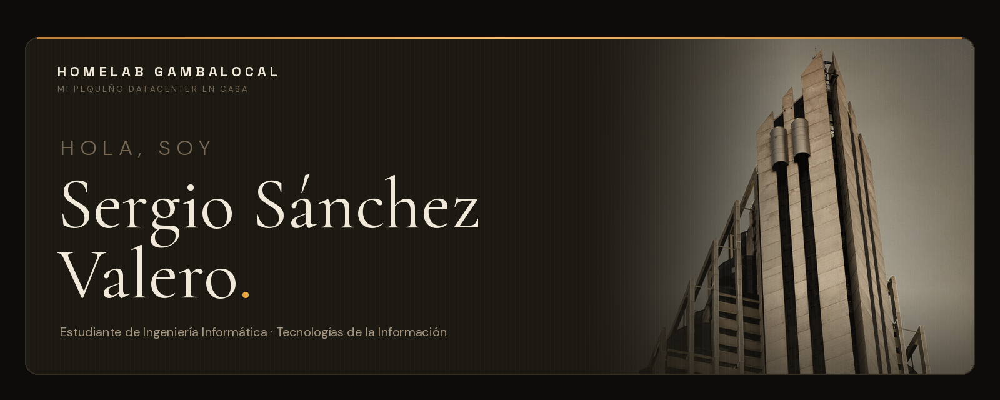

  

 
 

 

Estudio el **Grado** en Ingeniería Informática en la **ESIIAB** (Albacete), en la mención de **Tecnologías de la Información**, y estoy en mi último año.

Me interesa todo lo que tiene que ver con **sistemas, redes y seguridad**: montar infraestructura, entender cómo se rompe y dejarla de forma que se pueda mantener. Mi TFG va por ahí: la seguridad de la **IA autoalojada** con modelos abiertos (acceso, identidad y monitorización). Cuento también con experiencia en el desarrollo software, he trabajado en varios proyectos sobre ERPs (módulos de facturación, gestión de documentos, gestión de usuarios de intranet y buscadores avanzados), motores de sellado para Colegios Mayores (El repositorio "The Sellator" es el proyecto relacionado), tienda online y algún proyecto personal más enfocado en aspectos visuales de interfaces web. En el desarrollo web, el Stack que más he utilizado ha sido Vue 2/3 + Laravel 8/9/13 y con MySQL como sistema de gestión de bases de datos relacionales.

Os invito a echarle un vistazo a mi web personal www.gambalocal.es donde cuento con un proyecto de servicios auto-alojados muy interesantes y además podréis saber algo más de mí.
  
I’m interested in everything related to systems, networking, and security: building infrastructure, understanding how it can be compromised, and designing it so it’s maintainable. My capstone project focuses on that area: securing self-hosted AI based on open models, including access control, identity, and monitoring.

I also have software development experience and have worked on several projects, including ERP systems (invoicing modules, document management, intranet user management, and advanced search), ticketing systems for university residence halls (the “The Sellator” repository is the related project), an online store, and a few personal projects focused more on the visual aspects of web interfaces. For web development, the stack I’ve used most is Vue 2/3, Laravel 8/9/13, and MySQL for relational database management.

Feel free to check out my personal website at www.gambalocal.es, where you can learn about some interesting self-hosted services I run and find out a little more about me.
 

  
  
  
  
  

 

  
  
  
  
  

  

